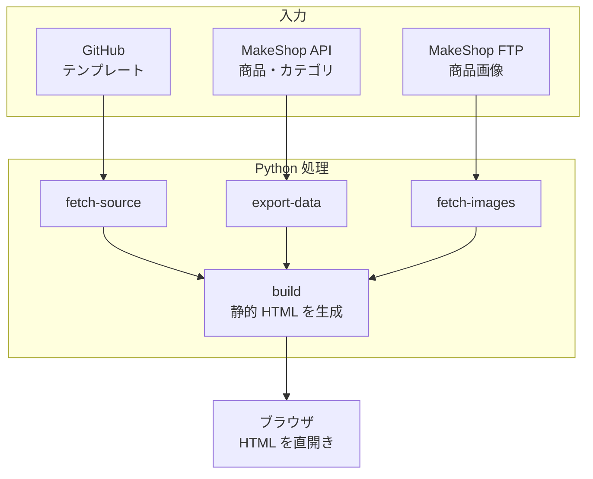

# EC Mockup

GitHub 上の EC サイトテンプレート、MakeShop GraphQL API、MakeShop の画像資産、実ショップ参照情報を使って、ローカル閲覧用の静的モックサイトを生成するプロジェクトです。

## 現在の実装概要

- 商品データ取得は MakeShop API を利用
- `export-data` は公開中の商品 (`display = Y`) のみを出力
- カテゴリ一覧は `getProductCategory` から取得
- 商品画像は MakeShop FTP または公開 URL から取得
- 購入前情報セクションは [13_purchase-info.html](work/source/original/18_モジュール管理/13_purchase-info.html) を全ページ下部に挿入
- `output/mock-site/categories/*.html` と `output/mock-site/products/*.html` を生成
- PyInstaller で CLI 実行ファイル化を確認済み

## 主要ドキュメント

- [環境変数仕様](docs/03_env仕様書.md)
- [配布対応手順](docs/12_実装手順書_Phase6_配布対応.md)
- [実装手順書一覧](docs/05_実装手順書_一覧.md)
- [Live Site Inspector CLI 仕様](docs/04_CLI仕様_LiveSiteInspector.md)

## 現在の生成フロー



`build` コマンドは `fetch-source` と `export-data` を内包します。画像取得は自動実行しないため、初回または商品差分があるときは `fetch-images` を別途実行してください。`build --skip-fetch` は、すでに取得済みのテンプレートとデータを使って HTML 生成だけをやり直すためのオプションです。

## セットアップ

1. `.env.example` をコピーして `.env` を作成する
2. 必要なら `config/mock-site.yaml.example` をコピーして `config/mock-site.yaml` を作成する
3. `.env` に GitHub、MakeShop API、MakeShop 画像取得、実ショップ参照の接続情報を設定する
4. 依存関係をインストールする

```powershell
pip install -e .
```

Playwright を使う `capture-live-site` を利用する場合は、追加でブラウザをインストールします。

```powershell
playwright install chromium
```

## 主要コマンド

```powershell
ec-mockup fetch-source
ec-mockup export-data --check
ec-mockup export-data
ec-mockup fetch-images --ftp --limit 200
ec-mockup build --skip-fetch
ec-mockup capture-live-site login-check
ec-mockup capture-live-site run --pages top,category,news --capture-screenshot
```

最小の閲覧手順だけなら次で十分です。

```powershell
ec-mockup build
ec-mockup fetch-images --ftp --limit 200
ec-mockup build --skip-fetch
```

## 実行要件メモ

- `export-data` は `.env` の `MAKESHOP_API_TOKEN` / `MAKESHOP_API_SECRET` / `MAKESHOP_API_KEY` を利用します
- `fetch-source` は `GITHUB_REPOSITORY` と `GITHUB_REF` を利用します
- `fetch-images --ftp` は FTP 接続情報を利用します
- `capture-live-site` を使う場合は Playwright のブラウザセットアップが必要です
- `capture-live-site diff` と `capture-live-site clean` は現状 TODO の雛形コマンドです

## 配布

PyInstaller 用の spec は [ec-mockup.spec](ec-mockup.spec) にあります。

```powershell
pip install -e .[dev]
pyinstaller ec-mockup.spec --noconfirm
```

配布時は `dist/ec-mockup/` フォルダ一式と `.env` を同階層に配置してください。現在確認済みなのは CLI 配布で、GUI 配布は継続課題です。

## 補足

- `.env` は Git 管理しません
- `work/` は取得物・中間生成物・キャッシュを保持します
- `debug/` には手動検証用の Python スクリプトを集約しています
- `docs/` のフェーズ手順書には設計時の履歴文書も含まれます。運用上の正本は README と環境変数仕様です