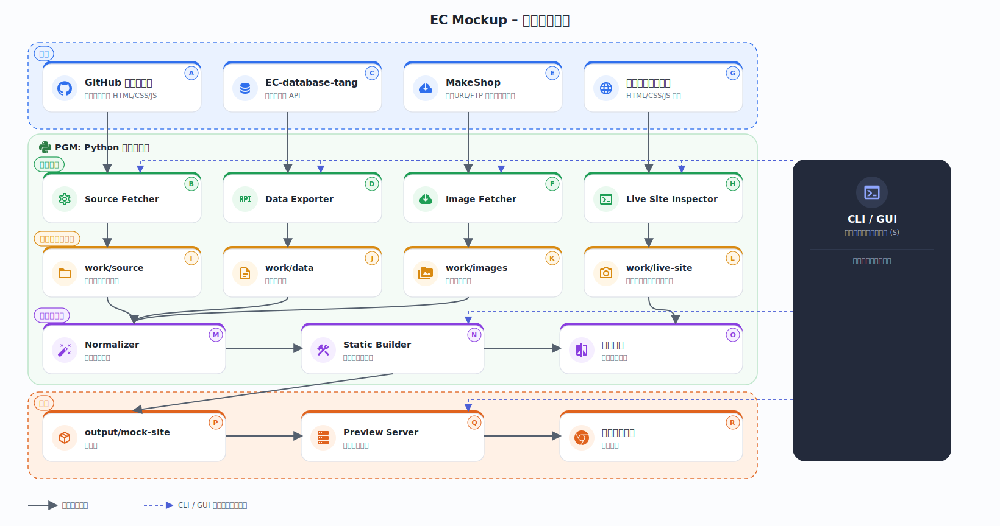
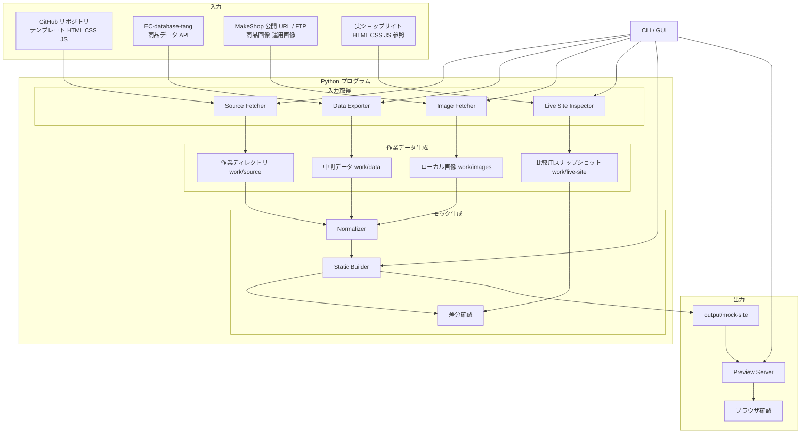

# EC Mockup

GitHub 上の EC サイトテンプレート、EC-database-tang の商品データ、MakeShop の画像資産、実ショップの参照情報を使って、ローカル閲覧用の静的モックサイトを生成するためのプロジェクトです。

## 現在の状態

- 企画、設計、実装手順のドキュメントを整備済み
- 実装はこれから Phase 1 に着手する段階
- GUI は CLI コアの後に対応予定

## 主要ドキュメント

- [構想書](docs/ローカルモック生成ツール構想.md)
- [プロジェクト計画書](docs/プロジェクト計画書.md)
- [実装手順書一覧](docs/実装手順書_一覧.md)
- [.env 仕様書](docs/env仕様書.md)
- [Live Site Inspector CLI 仕様](docs/CLI仕様_LiveSiteInspector.md)

## データフロー

Mermaid ソース（編集用）

## 初期セットアップ

1. `.env.example` をコピーして `.env` を作成する
2. `config/mock-site.yaml.example` をコピーして `config/mock-site.yaml` を作成する
3. `.env` に GitHub、ECDB API、MakeShop、実ショップ参照の接続情報を設定する
4. Phase 1 の手順に沿って CLI 基盤を実装する

## ディレクトリ方針

- `docs/`: 企画、仕様、手順書
- `config/`: 設定ファイル雛形と実設定
- `work/`: 中間取得物、スナップショット、キャッシュ
- `output/`: 生成されたモックサイト
- `src/`: 今後追加する実装本体

## 補足

- `.env` は Git 管理しません
- `docs/FTP接続情報.txt` は機密情報を含むため Git 管理対象外です
- 実ショップ参照は補助用途であり、生成の正本は GitHub テンプレートと商品データです